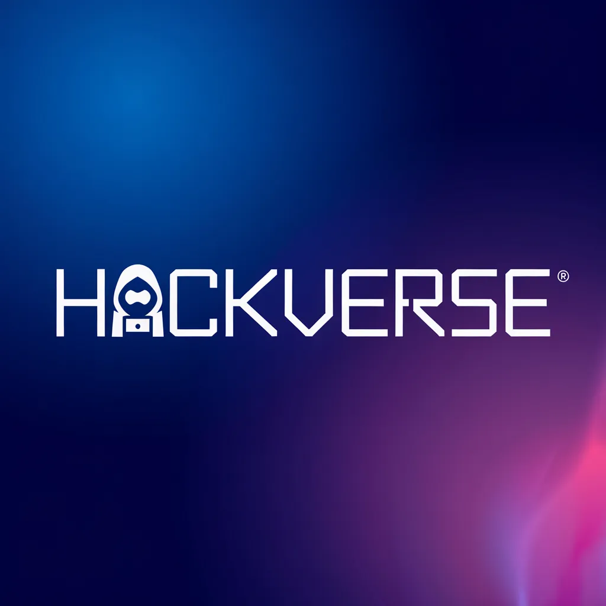

# 🚀 HackVerse - Revolucionando los Hackathones

HackVerse es una plataforma diseñada para facilitar la organización, gestión y participación en hackathones.

HackVerse conecta a desarrolladores, diseñadores y entusiastas de la programación y la tecnología en desafíos únicos.

Con una interfaz moderna, un backend robusto y una experiencia fluida, HackVerse permite a los participantes enfocarse en lo que realmente importa: **crear soluciones increíbles**.

## 📸 Vista previa

HackVerse se adapta en cualquier dispositivo.

| Escritorio 🖥                                     | Móvil 📱                                          |
| ------------------------------------------------ | ------------------------------------------------- |
|  |  |

---

## ✨ Características

### 🖥️ Frontend

✅ Diseño moderno, atractivo y **totalmente responsive** con **TailwindCSS**  
✅ Interfaz intuitiva y fácil de usar para una mejor experiencia de usuario  
✅ Navegación dinámica con **React Router**  
✅ Notificaciones amigables con **React Hot Toast**  
✅ Estilos personalizables y coherentes con el tema del proyecto  
✅ Animaciones sutiles para mejorar la interacción del usuario

### 🔧 Backend

✅ API RESTful desarrollada con **Express.js**  
✅ Base de datos relacional con **MySQL**  
✅ Autenticación segura con **JWT (JSON Web Tokens)**  
✅ Gestión de archivos con **Express File Upload**  
✅ Cifrado de contraseñas con **Bcrypt**  
✅ Validaciones robustas con **Joi**  
✅ Registro de actividad con **Morgan**  
✅ Configuración flexible con **Dotenv**  
✅ Soporte para CORS para conexión con el frontend  
✅ Sistema de envío de correos con **Nodemailer**

## 🛠️ Tecnologías Utilizadas

🖥️ &nbsp;&nbsp;**Frontend (Client)** - React + Vite, TailwindCSS

⚙️&nbsp;&nbsp;**Backend (Server)** - Node.js, Express, MySQL

🌐&nbsp;&nbsp;**API REST** - Para la comunicación entre el frontend y el backend.

## 📂 Estructura del Proyecto

```
hackathonPFB41rt/
|--- client/    # Frontend
|--- server/    # Backend
|--- README.md  # Este archivo
```

## 💾 **Clonar el repositorio**

Para obtener una copia local del proyecto, ejecuta :

```bash
git clone https://github.com/ezequielzaquiere/hackatonPFB41rt.git

cd hackatonPFB41rt
```

## 📜 **Detalles técnicos**

Para detalles técnicos, consulta:

-   🖥️ &nbsp;&nbsp;[Frontend](./client/README.md)
-   ⚙️&nbsp;&nbsp; [Backend](./server/README.md)

✉️ **Contáctanos:** [HackVerse](mailto:hackverse.hackathones@gmail.com)

🌐 **Repositorio:** [GitHub](https://github.com/ezequielzaquiere/hackatonPFB41rt)
